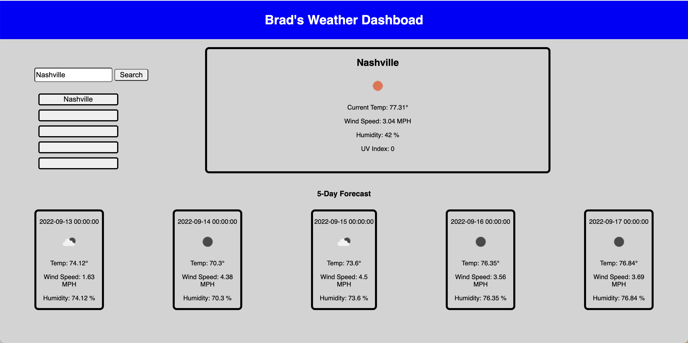
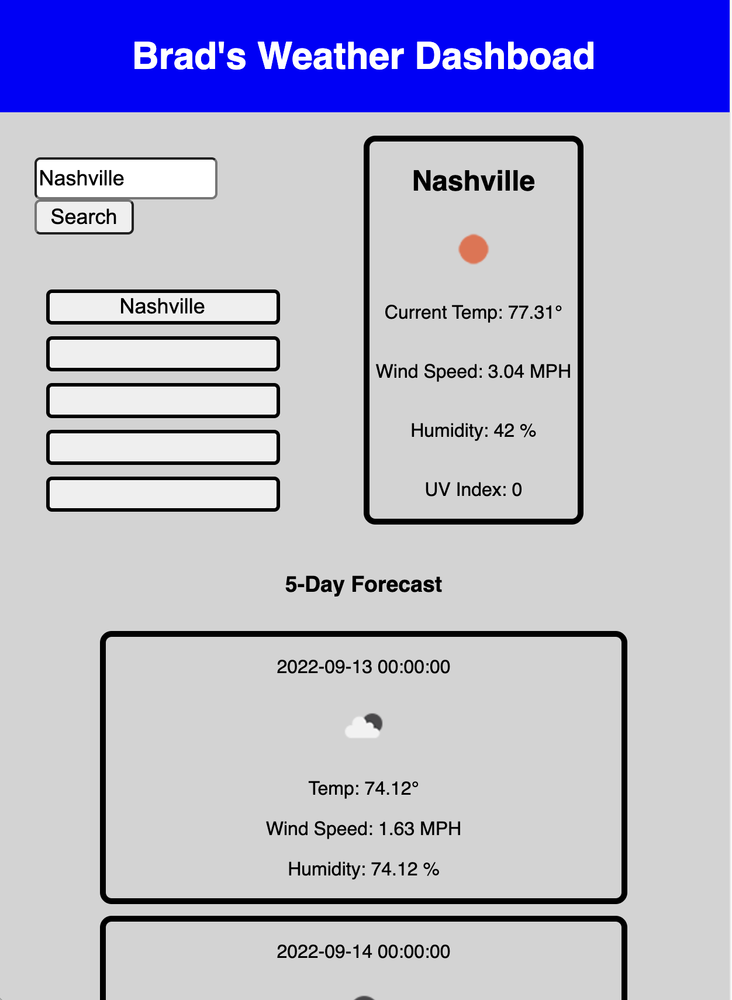

# Brad-s_3rdParty_API_Weather_App
Weather Dashboard created using Open Weather One Call API

## Deployed Application
[Brad's 3rd Party API Weather Dashboard](https://brad-hambrick.github.io/Brad-s_3rdParty_API_Weather_App/)

## Description
This project was completed in order to showcase the ability to work with javascript and 3rd Party API's.  This project has been one of my favorite activities and I plan to continue developing this project and could see myself using this application on a regular basis in my day to day life.

## Badges
All of the coding methods in this project were those that were learned during the Vanderbilt Coding Bootcamp.  The weather data and Icons are provided by Open Weather One Call API.  For further information on the API visit: https://openweathermap.org/api/one-call-api.

## Visuals

## Usage
This project was originally created to showcase my ability to implement 3rd Party API data using javascript.  However, I feel that this application, once developed further, will be utilized in my day to day life on a regular basis.  This application gives users the ability to search any city within the US by name and see the current weather conditions as well as a five day forecast.  This application will be extremely useful for planning outdoor trips and activities.  

## Support
For support, contact Brad Hambrick @bradleyhambrick@gmail.com

## Roadmap
This project is still in the very early phases and will be getting several alterations and improvements.  I plan to customize this application in order to pull additional data that will apply to the day to day activities of an outdoor enthusiast.    

## Contributing
This project is open to recommendations and future contributions.

## Authors and acknowledgment
Thanks to Vanderbilt Coding Bootcamp for contributing to the knowledge required to build this project.

## License
All weather data and icons were provided by Open Weather One Call API @ https://openweathermap.org/api/one-call-api.  

## Project status
The project is still in the early phases and will be getting future improvements and alterations.      